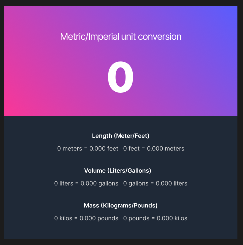
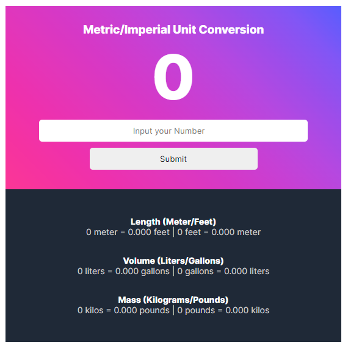
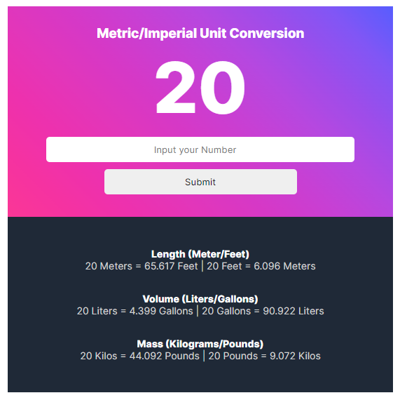

# Scrimba Solo Project - Unit Converter

This is a solution to the [Unit Converter by Scrimba](https://scrimba.com/learn/learnjavascript/).

## Table of contents

- [Overview](#overview)
  - [Screenshot](#screenshot)
  - [Links](#links)
- [My process](#my-process)
  - [Built with](#built-with)
  - [What I learned](#what-i-learned)
  - [Continued development](#continued-development)
- [Author](#author)


## Overview
This is Solo Project from a Javascript course on Scrimba. Figma design of a Unit Converter is given which is to be implemented.

### Screenshot








### Links

- Solution URL: [Solution Repository](https://github.com/Aphatheology/UnitConverter)

- Live Site URL: [Unit Converter](https://github.com/Aphatheology/UnitConverter)

## My process

### Built with

- HTML
- CSS 
- Javascript

### What I learned

I learned a perfect method to round up number to a decimal place. 

I learned how to get the values on input.

<!-- To see how you can add code snippets, see below:

```html

```
```css
img {
  inline-sizing: 100%;
}
``` -->

### Continued development

I will work on the Light Mode and integrate it.
If you have any suggestion on what to add, kindly send a message through the links below. Thanks

## Author

- Website - [Mustapha Aphatheology](https://www.github.com/aphatheology)
- Twitter - [@mustbeta](https://www.twitter.com/mustbeta)

